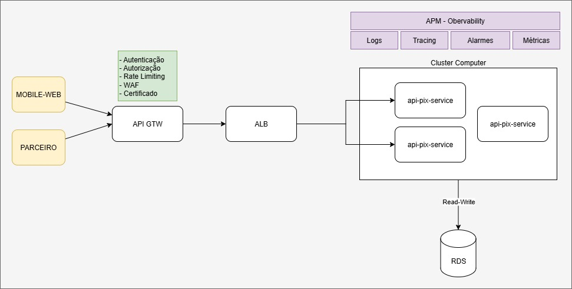

# Pix Service - Microserviço de Carteira Digital

Sistema de carteira digital com suporte completo a operações Pix, desenvolvido com Clean Architecture, garantindo **consistência**, **idempotência** e **auditabilidade**.

## Arquitetura

Este projeto segue os princípios de **Clean Architecture** com separação clara de responsabilidades:

- **Domain Layer**: Entidades de negócio, Value Objects e interfaces de repositórios
- **Use Case Layer**: Lógica de aplicação e casos de uso
- **Infrastructure Layer**: Implementações de persistência, controllers REST e configurações

### Diagrama de Arquitetura



O diagrama acima ilustra a arquitetura completa do sistema, incluindo:
- Fluxo de requisições HTTP através dos controllers
- Camadas da Clean Architecture (Domain, Use Case, Infrastructure)
- Integrações com PostgreSQL para persistência
- Sistema de eventos e webhooks para processamento assíncrono
- Componentes de observabilidade (Actuator, Prometheus, Logs)

### Principais Características

- **Consistência**: Garantia de exactly-once no débito usando transações ACID e locking pessimista
- **Idempotência**: Controle via `Idempotency-Key` header para transferências e `eventId` para webhooks
- **Concorrência**: Suporte a requisições simultâneas usando `SELECT FOR UPDATE`
- **Auditabilidade**: Ledger imutável de todas as operações financeiras
- **Observabilidade**: Logs estruturados e métricas com Actuator/Prometheus

## Tecnologias

- **Java 11** (compatível com Java 17+)
- **Spring Boot 2.7.18**
- **PostgreSQL 15**
- **Flyway** (migrações de banco de dados)
- **Maven** (gerenciamento de dependências)
- **Docker & Docker Compose**
- **SpringFox 3.0.0** (Swagger/OpenAPI documentation)
- **JUnit 5** (testes unitários e de integração)
- **Mockito** (mocks para testes)

## Pré-requisitos

- Java 11 ou superior
- Maven 3.8+
- Docker e Docker Compose

## Como Executar

### 1. Iniciar o Banco de Dados

```bash
docker-compose up -d
```

Isso iniciará:
- PostgreSQL na porta `5432`
- PgAdmin na porta `5050` (acesso: admin@admin.com / admin)

### 2. Compilar o Projeto

```bash
mvn clean install
```

### 3. Executar a Aplicação

```bash
mvn spring-boot:run
```

A aplicação estará disponível em: `http://localhost:8080`

## Documentação da API (Swagger)

A API possui documentação interativa completa usando **Swagger/OpenAPI**:

### Swagger UI (Documentação Interativa)
```
http://localhost:8080/swagger-ui/
```

Interface visual onde você pode:
- Visualizar todos os endpoints disponíveis
- Ver exemplos de requisições e respostas
- Testar os endpoints diretamente pelo navegador
- Ver códigos HTTP e descrições detalhadas

### OpenAPI JSON (Especificação)
```
http://localhost:8080/v2/api-docs
```

Especificação OpenAPI em formato JSON para:
- Importar em Postman, Insomnia ou outras ferramentas
- Gerar clientes automaticamente em várias linguagens
- Integração com ferramentas de teste

📖 Para mais detalhes sobre a documentação Swagger, consulte: [SWAGGER_DOCUMENTATION.md](./SWAGGER_DOCUMENTATION.md)

## Endpoints da API

### Carteiras

#### Criar Carteira
```http
POST /wallets
Content-Type: application/json

{
  "userId": "user123"
}
```

#### Registrar Chave Pix
```http
POST /wallets/{id}/pix-keys
Content-Type: application/json

{
  "keyType": "EMAIL",
  "keyValue": "user@example.com"
}
```

#### Consultar Saldo Atual
```http
GET /wallets/{id}/balance
```

#### Consultar Saldo Histórico
```http
GET /wallets/{id}/balance?at=2025-10-09T15:00:00
```

#### Depositar
```http
POST /wallets/{id}/deposit
Content-Type: application/json

{
  "amount": 100.00
}
```

#### Sacar
```http
POST /wallets/{id}/withdraw
Content-Type: application/json

{
  "amount": 50.00
}
```

### Transferências Pix

#### Realizar Transferência
```http
POST /pix/transfers
Idempotency-Key: unique-key-123
Content-Type: application/json

{
  "fromWalletId": 1,
  "pixKey": "user@example.com",
  "amount": 75.00
}
```

**Resposta:**
```json
{
  "endToEndId": "E12345678901234567890123456789012",
  "fromWalletId": 1,
  "toWalletId": 2,
  "amount": 75.00,
  "status": "PENDING"
}
```

#### Webhook (Confirmação/Rejeição)
```http
POST /pix/webhook
Content-Type: application/json

{
  "endToEndId": "E12345678901234567890123456789012",
  "eventId": "evt_abc123",
  "eventType": "CONFIRMED",
  "occurredAt": "2025-10-13T10:30:00"
}
```

Tipos de eventos:
- `CONFIRMED`: Transferência confirmada, crédito efetivado
- `REJECTED`: Transferência rejeitada, valor estornado

## Fluxo de Transferência Pix

1. Cliente envia `POST /pix/transfers` com `Idempotency-Key` header
2. Sistema valida saldo e resolve chave Pix
3. Débito imediato da carteira de origem
4. Transferência criada com status `PENDING`
5. EndToEndId único gerado
6. Webhook assíncrono confirma ou rejeita:
   - **CONFIRMED**: Crédito na carteira de destino
   - **REJECTED**: Estorno na carteira de origem

## Requisitos Não-Funcionais Atendidos

### Consistência
- Transações ACID do PostgreSQL
- Locking pessimista (`SELECT FOR UPDATE`) em operações críticas
- Validação de saldo dentro de transação

### Idempotência
- Header `Idempotency-Key` obrigatório em transferências
- `eventId` único em webhooks
- Tabela de controle com unique constraints
- Requisições duplicadas retornam resultado armazenado

### Concorrência
- Suporte a múltiplas requisições simultâneas
- Locking previne race conditions
- Efeito exactly-once garantido no débito

### Auditabilidade
- Ledger imutável de todas as transações
- Correlation IDs em logs (endToEndId, eventId)
- Timestamps em todas as entidades
- Histórico de saldo calculável a partir do ledger

### Observabilidade
- Logs estruturados (SLF4J/Logback)
- Métricas com Spring Boot Actuator
- Endpoint Prometheus: `/actuator/prometheus`
- Health checks: `/actuator/health`

## Estrutura do Banco de Dados

### Tabelas Principais

- **wallets**: Dados das carteiras com saldo e controle de versão
- **pix_keys**: Chaves Pix únicas associadas a carteiras
- **ledger_entries**: Ledger imutável de todas as operações
- **pix_transfers**: Transferências Pix com máquina de estados
- **idempotency_keys**: Controle de idempotência
- **webhook_events**: Eventos processados

## Máquina de Estados das Transferências

```
PENDING → CONFIRMED (sucesso)
PENDING → REJECTED (falha)
```

Estados terminais: CONFIRMED e REJECTED não permitem transições.

## Monitoramento

### Actuator Endpoints

- Health: `http://localhost:8080/actuator/health`
- Metrics: `http://localhost:8080/actuator/metrics`
- Prometheus: `http://localhost:8080/actuator/prometheus`

## Cenários de Concorrência Tratados

1. **Duplo Disparo**: Mesma transferência enviada 2x → apenas 1 débito
2. **Webhook Duplicado**: Mesmo eventId múltiplas vezes → processado 1x
3. **Webhooks Fora de Ordem**: REJECTED antes de CONFIRMED → transição validada
4. **Reprocessamento**: At least once delivery → idempotência garante resultado correto

## Decisões Arquiteturais

### Pessimistic Locking
Escolhido para operações críticas de débito para garantir consistência forte, evitando race conditions. Trade-off: leve impacto em performance vs. corretude garantida.

### Ledger Imutável
Todas as operações registradas em modo append-only, permitindo auditoria completa e reconstrução de saldo histórico.

### Idempotência por Tabela
Uso de tabela dedicada com unique constraints ao invés de cache distribuído, priorizando simplicidade e garantias ACID.